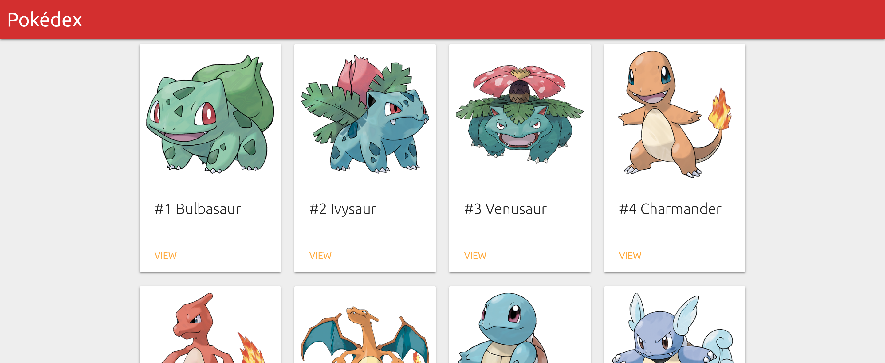
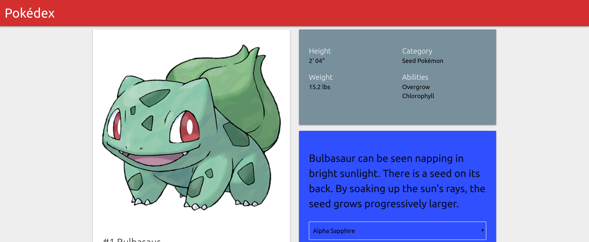

# Pokedex App

This project was generated with [Angular CLI](https://github.com/angular/angular-cli)

## Development Steps

- Clone the repository using ` git clone <repository link> `.
- Navigate to the cloned repository.
- Run ` npm install ` to install the dependencies.
- Run ` ng serve ` to serve and open ` localhost:4200 `.

## Build Steps

Run ` ng build ` to build the project. Use the flag ` --prod ` for production. 

## Project Images

## Demo

[Click Here](https://adityatandon007.github.io/pokedex-app/)